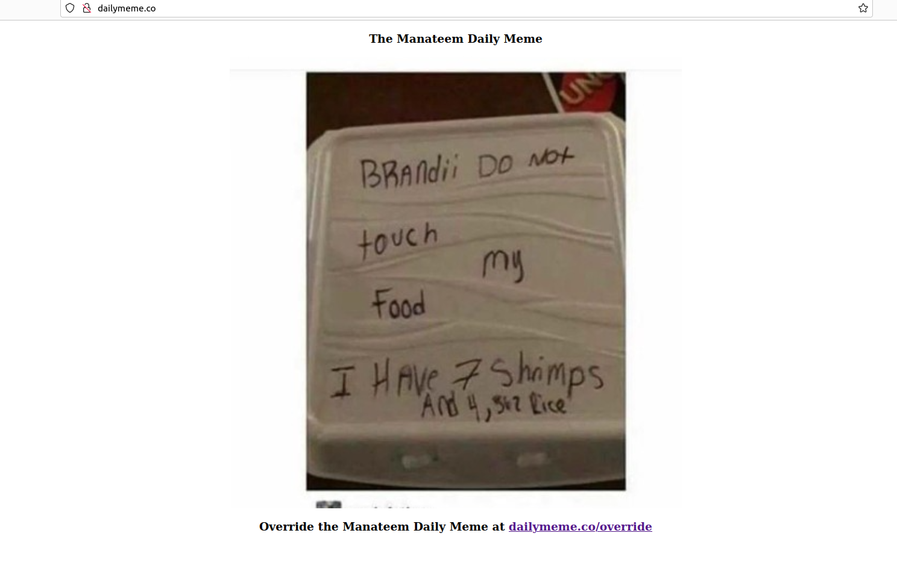

# daily_meme

Iterating on django-images to create a daily meme program

## Want to use this project?

1. Fork/Clone

2. Create and activate a virtual environment:

    ```sh
    $ python3 -m venv venv && source venv/bin/activate
    ```

3. Install the requirements:

    ```sh
    (venv)$ pip install -r requirements.txt
    ```

4. Apply the migrations:

    ```sh
    (venv)$ python manage.py migrate
    ```

5. Run the server:

    ```sh
    (venv)$ python manage.py runserver
    ```
    
 6. Navigate to [http://localhost:8000/](http://localhost:80/) in your favorite web browser.


 7. Example of Daily Meme website



 8. Example of Override Page


 9. Example of Overriden Front Page
